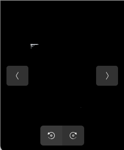

# image_separator
image separate for annotation data

## img_separator.py
- it is separate image A x A 
- cutting size is depend on original image size.

```
python img_separator.py

```
- input directory and output directory is necessary to rename your specific location.
- separate "A" is int number.

## nobject.py
- remove no object image file tool
- target for object detection in my case
- change parameter you can remove extra image in your sepcified directory

```
python nobject.py

```
### sample
There is any color found remained in the directory




### bboxer.py
- added autoannotation bbox. still under trial version.


### jsoncheck.py
- simple json file id and name checker
- If annotation file so many time, open file is difficult or spend lontime. easy to see!


```
python jsoncheck.py

```
